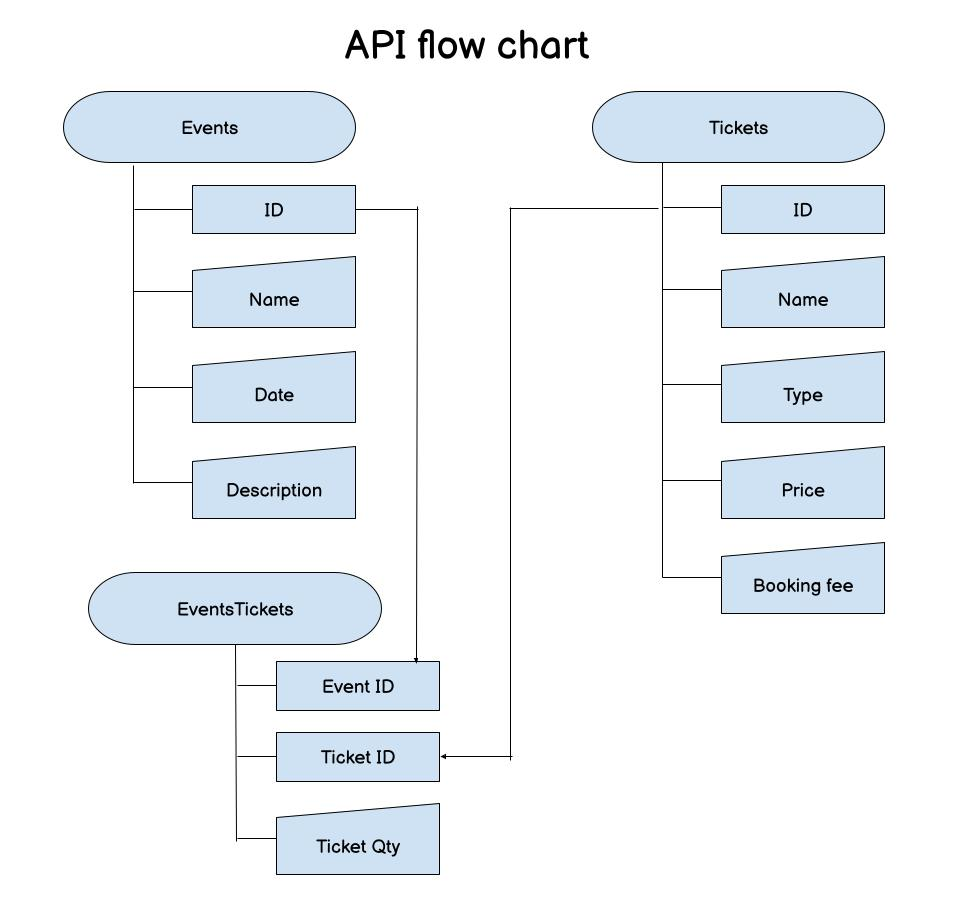

# Kaboodle 2025 Tech Test

Implementation of my tech test for a role at Kaboodle.

## Prerequisites

- Docker
- Make

## Project setup

| Task           | Description                                   |
| -------------- | --------------------------------------------- |
| `make up`      | Boot project up and run it in the background. |
| `make down`    | Stop project and remove containers.           |
| `make rebuild` | Re-build and restart project.                 |

## API flow

- Events - include event Name, Date and Description. User input. ID automagically generated.
- Tickets - include ticket Name, Type, Price and Booking Fee. ID automagically generated.
- EventTickets - include event ID, ticket ID and ticket Quantity. Event and ticket IDs refer to their specific tables.
